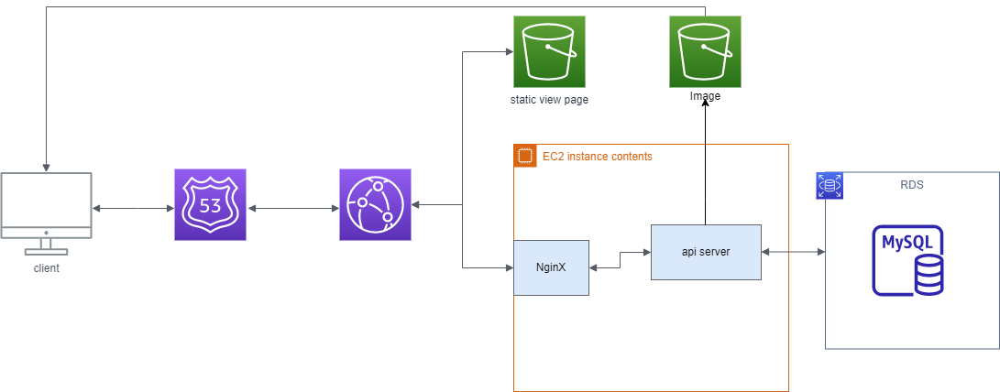
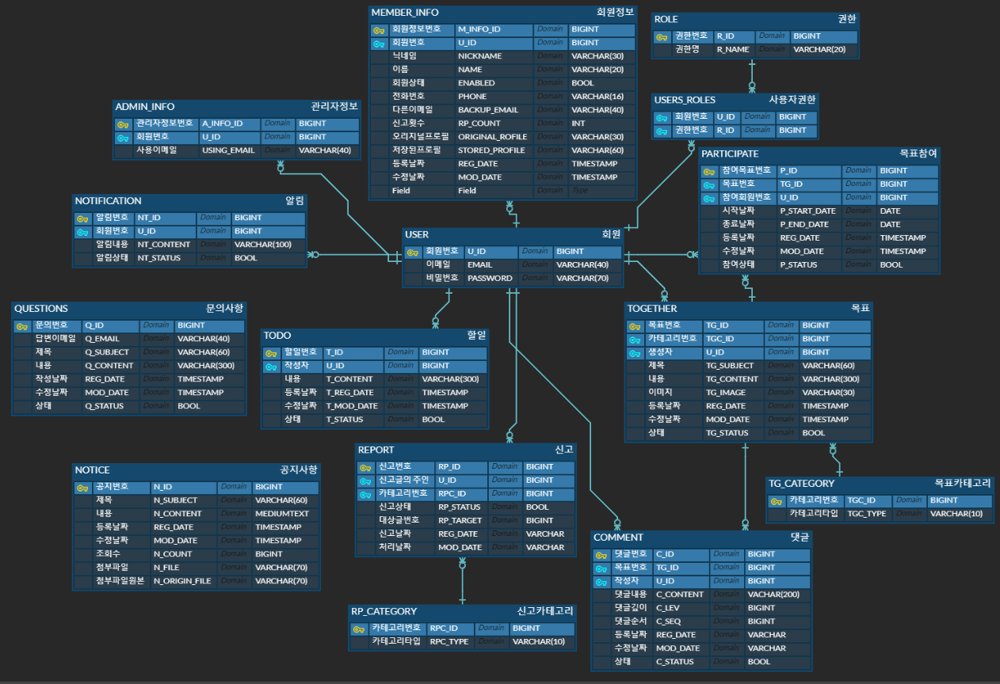

# [todo-together] 일정관리 및 목표공유 서비스
A web project sharing personal goals and managing todo list

## 개발환경
- Window 10
- Ubuntu 20.04 LTS
- Nginx 1.18.0
- GitHub
- Postman
- MysqlWorkbench

## 사용기술
### BackEnd
#### Spring Boot 2.6
- JAVA 1.8
- Spring Data JPA
- Spring Security
- JWT-Auth0
#### Build Tool
- Maven
#### Database
- Mysql 8.0
#### AWS
- EC2
- S3
- RDS
- CloudFront
- Route53

### FrontEnd
- React
 

## 시스템 구조
 
 

 
 

## ERD 설계

